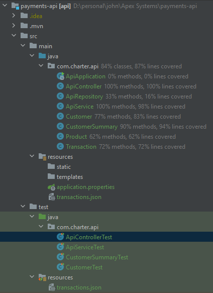

## Charter Homework Assignment   

### Input JSON 
#### The transactions.json file provides the input for this exercise.
[transactions.json](src/main/resources/transactions.json)

### Customer Points Summary Endpoint 
#### The customer records are returned with points calculated for 30, 60, 90, 90+, and total points.
[http://localhost:8080/payment/customerpoints](http://localhost:8080/payment/customerpoints)

##### JSON Response (based on transactions.json as input): 
```json
[
	{
		"customer": {
			"id": "c-1",
			"name": "John Smith"
		},
		"points30": 243,
		"points60": 3071,
		"points90": 31,
		"pointsOver90": 2442,
		"pointsTotal": 5787
	},
	{
		"customer": {
			"id": "c-2",
			"name": "Jane Doe"
		},
		"points30": 425,
		"points60": 0,
		"points90": 600,
		"pointsOver90": 0,
		"pointsTotal": 1025
	}
]
```

### Transactions Endpoint
#### This endpoint returns the transactions and points per transaction
[http://localhost:8080/payment/transactions](http://localhost:8080/payment/transactions)

##### JSON Response (based on transactions.json as input):
```json
[
	{
		"id": "tx-1",
		"date": "2023-01-29T00:00:00.000+00:00",
		"products": [
			{
				"id": "p-1",
				"name": "Drill",
				"price": 123
			},
			{
				"id": "p-2",
				"name": "Hammer",
				"price": 70
			}
		],
		"customer": {
			"id": "c-1",
			"name": "John Smith"
		},
		"totalPrice": 193,
		"totalPoints": 243
	},
	{
		"id": "tx-2",
		"date": "2022-12-29T00:00:00.000+00:00",
		"products": [
			{
				"id": "p-4",
				"name": "Screw driver",
				"price": 12
			},
			{
				"id": "p-5",
				"name": "bucket",
				"price": 70
			}
		],
		"customer": {
			"id": "c-1",
			"name": "John Smith"
		},
		"totalPrice": 82,
		"totalPoints": 32
	},
	{
		"id": "tx-3",
		"date": "2022-12-15T00:00:00.000+00:00",
		"products": [
			{
				"id": "p-7",
				"name": "Screw driver 2",
				"price": 1099
			},
			{
				"id": "p-8",
				"name": "bucket 2",
				"price": 70
			}
		],
		"customer": {
			"id": "c-1",
			"name": "John Smith"
		},
		"totalPrice": 1169,
		"totalPoints": 2219
	},
	{
		"id": "tx-4",
		"date": "2023-01-29T00:00:00.000+00:00",
		"products": [
			{
				"id": "p-1",
				"name": "Drill",
				"price": 123
			},
			{
				"id": "p-2",
				"name": "Hammer",
				"price": 70
			},
			{
				"id": "p-4",
				"name": "Screw driver",
				"price": 12
			},
			{
				"id": "p-5",
				"name": "bucket",
				"price": 70
			}
		],
		"customer": {
			"id": "c-2",
			"name": "Jane Doe"
		},
		"totalPrice": 275,
		"totalPoints": 425
	},
	{
		"id": "tx-5",
		"date": "2022-12-15T00:00:00.000+00:00",
		"products": [
			{
				"id": "p-10",
				"name": "Truck Rental",
				"price": 400
			},
			{
				"id": "p-11",
				"name": "Hammer Drill",
				"price": 70
			}
		],
		"customer": {
			"id": "c-1",
			"name": "John Smith"
		},
		"totalPrice": 470,
		"totalPoints": 820
	},
	{
		"id": "tx-6",
		"date": "2022-11-15T00:00:00.000+00:00",
		"products": [
			{
				"id": "p-12",
				"name": "Rake",
				"price": 11
			},
			{
				"id": "p-13",
				"name": "Shovel",
				"price": 70
			}
		],
		"customer": {
			"id": "c-1",
			"name": "John Smith"
		},
		"totalPrice": 81,
		"totalPoints": 31
	},
	{
		"id": "tx-7",
		"date": "2022-04-15T00:00:00.000+00:00",
		"products": [
			{
				"id": "p-14",
				"name": "Red Mulch",
				"price": 101
			},
			{
				"id": "p-15",
				"name": "Trees",
				"price": 1191
			}
		],
		"customer": {
			"id": "c-1",
			"name": "John Smith"
		},
		"totalPrice": 1292,
		"totalPoints": 2442
	},
	{
		"id": "tx-8",
		"date": "2022-11-15T00:00:00.000+00:00",
		"products": [
			{
				"id": "p-16",
				"name": "Black Mulch",
				"price": 101
			},
			{
				"id": "p-17",
				"name": "Bushes",
				"price": 201
			}
		],
		"customer": {
			"id": "c-2",
			"name": "Jane Doe"
		},
		"totalPrice": 302,
		"totalPoints": 600
	}
]
```

## Unit Test Coverage
